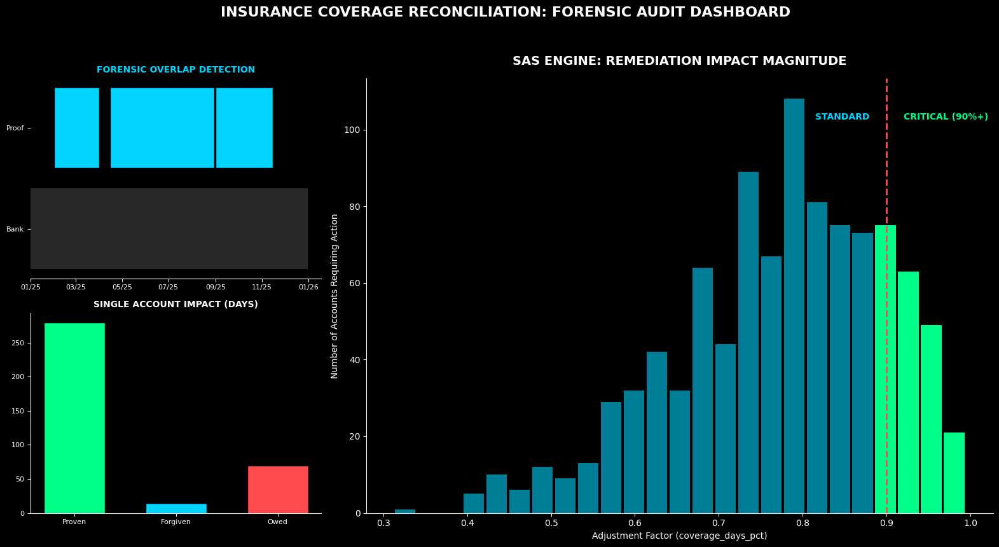

# Insurance Coverage Reconciliation: Audit and Liability Cost Signal

## Strategic Intent: Coverage Reconciliation for High-Stakes Remediation

How do you reconcile bank-issued insurance policy windows against customer proof-of-coverage evidence and translate the results into a defensible financial adjustment signal?

This SAS project implements a coverage reconciliation engine that determines bank-issued policy adjustments after customer proof of coverage is received. It merges overlapping proof-of-coverage periods, compares those periods against the bank-issued policy window, applies a configurable lapse threshold, and calculates the percentage factor owed back to the customer.

The objective is to make complex policy-window reconciliation explainable, repeatable, and audit-ready.

This project demonstrates a practical remediation design principle:

> Coverage reconciliation should not stop at identifying date gaps.  
> It should produce a clear adjustment factor, a transparent policy-gap rationale, and an executive liability signal.

---

## Executive Dashboard

[](./docs/executive_dashboard_preview.png)

[Open dashboard full size](./docs/executive_dashboard_preview.png)

The dashboard translates the SAS reconciliation logic into an executive view of coverage overlap, single-account impact, and program-level liability concentration.

### Dashboard Interpretation

#### Forensic Overlap Detection

The timeline view shows the relationship between:

```text
Bank-issued policy window
vs.
Customer proof-of-coverage windows
```

This gives reviewers a visual audit trail for where coverage exists, where gaps remain, and where proof evidence changes the policy adjustment outcome.

#### Single Account Impact

The single-account impact panel illustrates how the lapse-threshold logic can differentiate between:

```text
proven coverage days
forgiven short gaps
remaining responsible days
```

This supports a customer-centric approach by preventing immaterial coverage gaps from overstating the customer-responsible portion.

#### Executive Cost Signal

The right-side liability view aggregates account-level adjustment factors into program-level impact tiers. This helps leadership identify where financial exposure is concentrated and where remediation cost signal is material.

---

## Coverage Reconciliation Framework

### 1. Input Structure

The engine expects a SAS input table:

```sas
work.intake
```

Required conceptual fields:

| Field | Purpose |
|---|---|
| `id` | Account / customer / policy identifier |
| `policy_start` | Bank-issued policy start date |
| `policy_end` | Bank-issued policy end date |
| `coverage_start` | Customer proof-of-coverage start date |
| `coverage_end` | Customer proof-of-coverage end date |

The input may contain multiple proof-of-coverage date ranges per `id`.

### 2. Merge Overlapping Proof Periods

The first major logic layer merges overlapping proof-of-coverage windows.

The script:

1. Sorts incoming records by identifier, policy window, and proof dates.
2. Transposes coverage start and end dates into dynamic arrays.
3. Uses nested macro loops to compare adjacent proof windows.
4. Collapses overlapping or contiguous proof windows into consolidated coverage periods.
5. Restacks the adjusted coverage ranges for downstream lapse review.

This makes the engine resilient to fragmented proof evidence where customers provide multiple overlapping insurance records.

### 3. Compare Proof Coverage Against Bank Policy

The second major logic layer compares consolidated proof periods against the bank-issued policy window.

The logic identifies whether proof coverage:

- fully covers the policy window
- partially covers the beginning of the policy window
- partially covers the end of the policy window
- sits inside the policy window
- falls outside the policy window and has no adjustment impact

This narrows the reconciliation to proof periods that create a potential policy-days adjustment.

### 4. Apply Lapse-Threshold Logic

The engine uses a configurable macro variable:

```sas
%let lapse_threshold = ;
```

This threshold controls how short coverage gaps are treated.

Conceptually:

```text
short gaps within the configured threshold
→ considered covered / forgiven

larger gaps beyond the configured threshold
→ remain customer-responsible
```

This creates a customer-centric approach that prevents immaterial proof timing gaps from overstating the amount a customer is responsible for.

### 5. Calculate Adjustment Factors

The final output calculates:

| Field | Meaning |
|---|---|
| `responsible_days` | Remaining lapse days still treated as customer-responsible |
| `coverage_days` | Policy days supported by proof coverage or threshold forgiveness |
| `coverage_days_pct` | Percentage factor owed back to the customer |
| `responsible_days_pct` | Percentage factor still treated as customer-responsible |

The key final field is:

```sas
coverage_days_pct
```

This represents the percentage factor owed back to the customer.

---

## Primary Output

The main output table is:

```sas
work.coverage_adjustment_final
```

This table contains the account-level result after:

```text
proof-of-coverage consolidation
→ policy-window comparison
→ lapse-threshold evaluation
→ adjustment factor calculation
```

The output is intended to support financial remediation calculations, executive cost signaling, and audit review.

---

## Executive Interpretation

### Lapse-Threshold Philosophy

The framework applies a customer-centric interpretation of short coverage gaps. Small timing gaps within the configured threshold are treated as covered so the customer is not penalized for immaterial proof-window misalignment.

### From Raw Proof Dates to Financial Signal

Raw proof-of-coverage records can be fragmented, overlapping, duplicated, or difficult to interpret. This engine transforms those raw date windows into a clear adjustment factor that can be used downstream for remediation calculations.

### Audit-Ready Lineage

The logic preserves a transparent chain:

```text
bank policy window
→ customer proof windows
→ merged proof periods
→ remaining lapse days
→ coverage days
→ percentage factor owed back
```

This makes the result explainable to technical owners, finance, legal, operations, and audit stakeholders.

### Executive Liability Mapping

The dashboard extends the account-level factor into a program-level cost signal. It helps leadership understand whether liability is concentrated in standard, moderate, or critical exposure tiers.

---

## Technical Architecture

### Core Source File

Primary source file:

[`src/policy_coverage_reconciliation.sas`](./src/policy_coverage_reconciliation.sas)

### Main SAS Techniques

The engine uses:

- `PROC SORT` for ordered proof-window processing
- `PROC TRANSPOSE` to convert multiple coverage dates into dynamic arrays
- `dictionary.tables` and `dictionary.columns` for metadata-driven loop construction
- SAS macro loops for dynamic date-range comparison
- date arithmetic for policy-window and gap evaluation
- `PROC MEANS` for account-level aggregation of proof coverage counts
- data step logic for final lapse and percentage calculations

### Macro Components

The implementation contains two primary macro-driven logic blocks.

#### `coverage_date_ranges`

Purpose:

```text
Merge overlapping customer proof-of-coverage date ranges.
```

This macro dynamically compares adjacent coverage ranges and collapses overlaps so downstream lapse calculations operate on consolidated proof windows.

#### `lapse_review`

Purpose:

```text
Compare consolidated proof windows against bank policy windows and calculate adjustment factors.
```

This macro evaluates start gaps, end gaps, and middle gaps between proof periods, then calculates responsible days, coverage days, and the final percentage factors.

---

## Repository Contents

```text
insurance-coverage-reconciliation/
│
├── README.md
│
├── docs/
│   └── executive_dashboard_preview.png
│
└── src/
    └── policy_coverage_reconciliation.sas
```

### Core Artifacts

| Artifact | Purpose |
|---|---|
| [`docs/executive_dashboard_preview.png`](./docs/executive_dashboard_preview.png) | Executive dashboard preview |
| [`src/policy_coverage_reconciliation.sas`](./src/policy_coverage_reconciliation.sas) | SAS coverage reconciliation and adjustment-factor engine |

---

## How to Run

### 1. Prepare Input Data

Create or load the source table:

```sas
work.intake
```

Minimum conceptual structure:

```sas
id
policy_start
policy_end
coverage_start
coverage_end
```

Each account may have one or more proof-of-coverage windows.

### 2. Set the Lapse Threshold

Update:

```sas
%let lapse_threshold = ;
```

Example:

```sas
%let lapse_threshold = 30;
```

The threshold should be governed by the business, legal, remediation, or compliance context.

### 3. Run the SAS Script

Run:

```text
src/policy_coverage_reconciliation.sas
```

### 4. Review the Final Output

Inspect:

```sas
work.coverage_adjustment_final
```

Key fields to review:

```sas
coverage_days
responsible_days
coverage_days_pct
responsible_days_pct
```

---

## Supported Boundaries

This project is a synthetic / portfolio demonstration of insurance coverage reconciliation methodology.

Important boundaries:

- The engine does not expose real insurance, customer, or remediation data.
- The lapse threshold is intentionally configurable and must be governed externally.
- `coverage_days_pct` is an adjustment factor, not a full remediation payment calculation by itself.
- The project demonstrates reconciliation methodology, not production claims adjudication.
- Any production use would require legal, compliance, finance, operational, and audit governance review.

---

## Data Privacy and Interpretation Boundaries

All data and visual outputs in this repository are generated from synthetic or anonymized datasets to protect proprietary information.

This framework demonstrates methodology for high-stakes enterprise and regulatory environments, but it does not expose real customer data, proprietary remediation rules, confidential policy logic, or regulated production pipelines.

Important interpretation boundaries:

- Dashboard values are demonstration values, not production remediation totals.
- The script calculates coverage adjustment factors, not final customer payments.
- The output should be interpreted as reconciliation evidence and adjustment support.
- Coverage rules and thresholds must be approved in the applicable business and regulatory context.

---

## Portfolio Philosophy

**No Cold Handoffs** — engineering zero-defect, audit-ready results so stakeholders internalize the underlying “why.”

This project is designed to ensure that coverage reconciliation does not remain a technical black box. The goal is to translate policy windows, proof evidence, gap logic, and adjustment factors into a clear narrative that finance, legal, risk, audit, and operations stakeholders can understand and defend.
